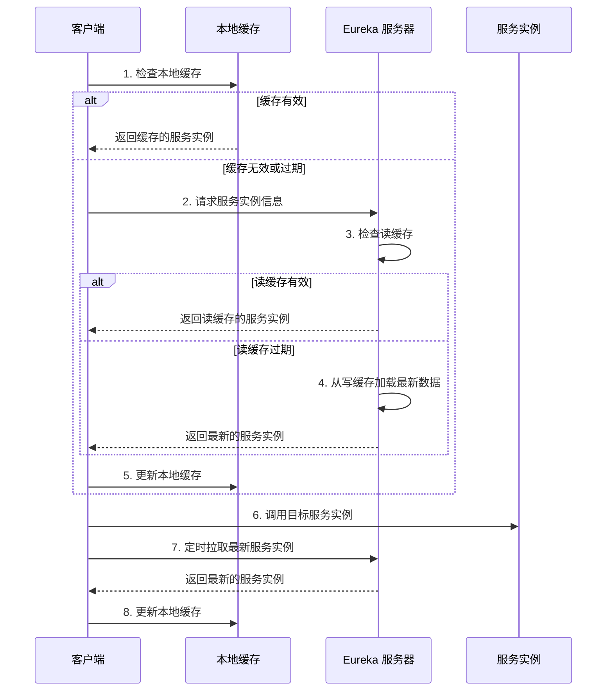

# Eureka
配置中心核心功能：

* 集中化管理
* 版本管理
* 动态更新
* 权限控制
* 环境隔离

基本功能：

* 服务发现
eureka客户端可以向eureka服务端获取服务实例列表
* 服务注册
eureka客户端启动的时候
* 三级缓存
   * 读缓存 ReadOnlyCache
   * 写缓存 WriteCache
   * 注册表缓存
* 自我保护机制
在网络通讯产生问题时，避免大量正常客服端实例被清除

   * eureka 自我保护机制服务端相关影响配置

```yaml
eureka:
  server:
    enable-self-preservation: true  # 默认true，开启自我保护
    renewal-percent-threshold: 0.85  # 续约百分比阈值，默认0.85
    renewal-threshold-update-interval-ms: 900000  # 更新阈值的时间间隔，默认15分钟
```
   * eureka 自我保护机制客户端相关影响配置

```yaml
eureka:
  instance:
    lease-renewal-interval-in-seconds: 30  # 客户端续约间隔，默认30秒
    lease-expiration-duration-in-seconds: 90  # 服务过期时间，默认90秒
```
#### 客户端服务注册流程
每当有客服端服务启动时，客户端会根据配置eureka服务端的地址，向服务端发起注册动作，服务端收到注册请求，会更新注册表缓冲信息，增加新的客户端信息到注册表缓冲，然后将注册表信息更新到写缓存。

#### 客户端读取数据流程
1. 客户端查看本地缓存是否存在
   1. 存在：直接返回本地缓存中的数据
   2. 不存在：请求服务端获取数据
      1. 获取读缓存，存在直接返回；不存在直接进入下一步
      2. 获取写缓存，存在直接返回，并且将数据更新到读缓存；不存在直接进入下一步
      3. 获取注册表缓存，存在直接返回，并且将数据更新到读缓存与写缓存

#### 缓存更新场景
注册表更新场景：

1. 服务实例注册
2. 服务实例注销
3. 服务实例续约（心跳）
4. 服务实例状态变更

写缓存更新场景：

1. 每当注册表发生变化时，写缓存会被同时更新到最新的注册表信息

读缓存更新场景：

1. 每隔30s会同步写缓存数据

#### Eureka 中服务实例的状态主要包括以下几种：
* UP：服务实例正常运行，可接收请求。
   * 当eureka服务实例发起服务注册时
   * 当eureka服务实例发起心跳，进行续期成功后，保持UP状态
   * 当eureka服务实例启动成功后，将状态从STARTING更改为UP
* DOWN：服务实例不可用。
   * 当eureka服务实例主动注销
   * 当eureka实例在规定的时间（默认90s）内没有发送心跳消息
* STARTING：服务实例正在启动。
   * 当服务器启动时
* OUT\_OF\_SERVICE：服务实例被手动下线，不可用。
   * 通过Eureka的管理接口或者UI，可以手动将状态从UP更改为OUT\_OF\_SERVICE
* UNKNOWN：服务实例状态未知。
   * 当网络分区时（网络问题导致服务之间无法通讯），Eureka服务端无法确认服务实例的状态时，就会将状态改为 UNKNOWN 


#### Eureka各端缓存应用交互

