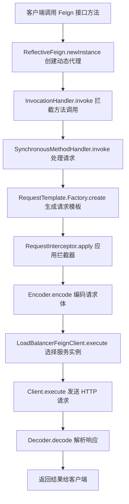

## 什么是Feign
* Feign 是 Netflix 开源的声明式 HTTP 客户端，用于简化 RESTful 服务的调用
* 通过定义接口和注解，Feign 可以自动生成HTTP请求的实现

## 特点
* 声明式 API ：通过接口注解定义 HTTP 请求，无需手动编写 HTTP 客户端代码
* 集成 Ribbon ：默认集成 Ribbon ，支持客户端负载均衡
* 集成 Hystrix ：支持熔断和降级机制
* 可扩展性：支持自定义编码器、解码器和拦截器

## 工作原理
## （1）接口定义
* 使用 @FeignClient 注解定义 Feign 客户端接口
* 通过方法注解（如 **@GetMapping**、**@PostMapping**）定义 HTTP 请求

### （2）动态代理
* Feign 通过动态代理技术生成接口的实现类
* 在运行时，Feign 会将方法调用转换为 Http 请求

### （3）请求处理
* Feign 根据接口定义生成 HTTP 请求，并通过 Ribbon 进行负载均衡
* 请求结果通过解码器为 Java 对象
### （4）集成 Ribbon 和 Hystrix
* Feign 默认集成了 Ribbon，支持客户端负载均衡
* 通过配置可以启用 Hystrix，实现熔断和降级

## Feign 的配置
### （1）基本配置
* 使用 @FeignClient 注解定义 Feign 客户端：

```java
@FeignClient(name = "service-name", url = "http://localhost:8080")
public interface MyFeignClient {
    @GetMapping("/endpoint")
    String getResponse();
}
```
### （2）负载均衡
### * Feign 默认集成了 Ribbon，无需额外配置
### * 可以通过配置文件自定义 Ribbon 的负载均衡策略：
```yaml
service-name:
  ribbon:
    NFLoadBalancerRuleClassName: com.netflix.loadbalancer.RoundRobinRule
```
### （3）熔断和降级
* 通过 **@FeignClient** 的** Fallback** 属性指定降级类：

```java
@FeignClient(name = "service-name", fallback = MyFeignClientFallback.class)
public interface MyFeignClient {
    @GetMapping("/endpoint")
    String getResponse();
}

@Component
public class MyFeignClientFallback implements MyFeignClient {
    @Override
    public String getResponse() {
        return "Fallback response";
    }
}
```
### （4）自定义配置
* 通过 **@Configuration **类自定义 Feign 的编码器、解码器和拦截器：

```java
@Configuration
public class FeignConfig {
    @Bean
    public Encoder feignEncoder() {
        return new JacksonEncoder();
    }

    @Bean
    public Decoder feignDecoder() {
        return new JacksonDecoder();
    }

    @Bean
    public RequestInterceptor feignRequestInterceptor() {
        return template -> template.header("Authorization", "Bearer token");
    }
}
```
## Feign 的使用场景
### （1）微服务调用
* 在微服务架构中，Feign 常用于服务之间的调用
* 自定义接口和注解，简化 HTTP 请求的编写

### （2）负载均衡
* Feign 默认集成了 Ribbon，支持客户端负载均衡
* 可以根据配置选择不同的负载均衡策略

### （3）熔断和降级
* 通过集成 Hystrix，Feign 支持熔断和降级机制
* 当服务不可用时，可以返回降级结果，避免系统崩溃

### （4）自定义 HTTP 客户端
* Feign 支持自定义编码器、解码器和拦截器，满足复杂的业务需求

## Feign 的底层原理
### （1）动态代理
* Feign 通过 JDK 动态代理或者 CGLIB 生成接口的实现类
* 在运行时，Feign 会将方法调用转换为 HTTP 请求
### （2）请求模版
* Feign 使用 RequestTemplate 类表示 HTTP 请求模版
* 通过解析接口注解和方法参数，生成具体的 HTTP 请求
### （3）编码器和解码器
* Feign 使用编码器将 Java 对象转换为 HTTP 请求体
* 使用编码器将 HTTP 响应体转为 Java 对象

### （4）拦截器
* Feign 支持请求拦截器，可以在发送请求前修改请求头或者请求体



