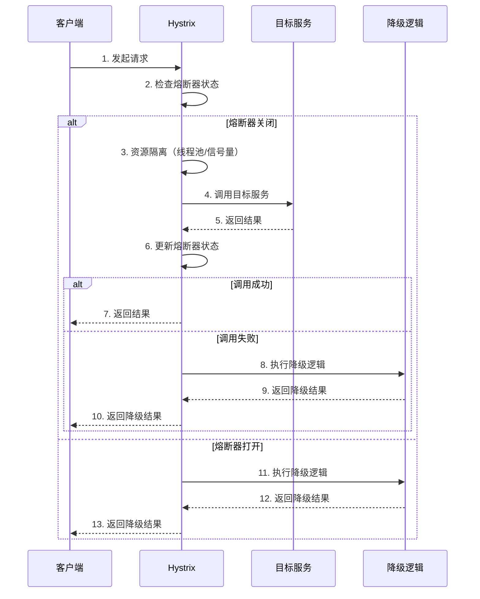

### 功能
* 服务熔断
* 服务降级
* 资源隔离
* 请求缓存
* 请求合并

### 核心思想
* 防止服务雪崩
当一个服务发生故障时，避免故障扩散到整个系统
* 快速失败
通过熔断机制快速失败。避免资源耗尽。
* 优雅降级
在服务不可用的时候，提供备用方案（Fallback）

### 熔断器（Circuit Breaker）
* 原理
   * 当服务的容错率超过阈值时，熔断器会被打开，后续请求会直接失败，不再调用目标服务
   * 熔断器打开一段时间后，会进入半打开状态，尝试恢复服务
* 关键参数
   * circuitBreaker.requestVolumeThreshold：触发熔断器需要最小请求数
   * circuitBreaker.errorThresholdPercentage：错误率阈值（默认为50%）
   * circuitBreaker.sleepWindowInMilliseconds：熔断器打开后的休眠时间（默认为5秒）

### 资源隔离
* 线程池隔离
   * 每个服务调用使用独立的线程池，避免资源竞争
   * 通过 HystrixThreadPoolKey 配置线程池
* 信号量隔离
   * 使用信号量限制并发数，适用于轻量级调用（执行时间短的任务）

### 服务降级
* 原理
   * 当服务调用失败或者熔断器打开时，执行降级逻辑
   * 降级逻辑可以是返回默认值、调用备用服务等
* 实现
   * 通过 HystrixCommand(fallbackMethod = "fallbackMethod") 指定降级方法

### 请求缓存
* 原理
   * 对相同请求参数，Hystrix 可以缓存结果，减少重复调用
* 实现
   * 使用 @CacheResult 和 @CacheKey 注解

### 请求合并
* 原理
   * 将多个请求合并为一个批量请求，减少网络开销
* 实现
   * 使用 @HystrixCollapser 注解

### 工作流程
1. 请求进入：
   1. 请求被 Hystrix 拦截
2. 检查熔断器状态
   1. 如果熔断器打开，直接执行降级逻辑
3. 资源隔离
   1. 根据配置选择线程池隔离或信号量隔离
4. 执行目标服务
   1. 调用目标服务，记录成功或者失败
5. 更新熔断器状态
   1. 根据调用结果更新熔断器状态
6. 执行降级逻辑
   1. 如果调用失败或者熔断器打开，执行降级逻辑
7. 返回结果
   1. 返回调用结果或者降级结果

### 底层原理
1. 熔断器实现
   1. 状态机
      1. 熔断器有三种状态：CLOSED （关闭）、OPEN（打开）、HALF\_OPEN（半开）
      2. 状态转换基于容错率和请求量
   2. 滑动窗口
      1. 使用滑动窗口统计最近一段时间的请求成功率和错误率
2. 线程池隔离
   1. 线程池管理
      1. 每个服务调用使用独立的线程池，避免资源竞争
      2. 线程池大小通过 **coreSize **和 **maxSize **配置。
   2. 队列管理
      1. 使用有界队列（**BlockingQueue**）控制请求排队
3. 信号量隔离
   1. 信号量机制
      1. 使用 **Semaphore **控制并发请求书
      2. 适用于轻量级调用，减少线程切换开销
4. 请求缓存
   1. 缓存实现
      1. 使用 **ConcurrentHashMap** 存储缓存结果
      2. 通过 **@CacheKey** 指定缓存键
5. 请求合并
   1. 合并实现
      1. 使用 **BatchCommand** 将多个请求合并为一个批量请求
      2. 通过 **@HystrixCollapser** 配置合并规则

