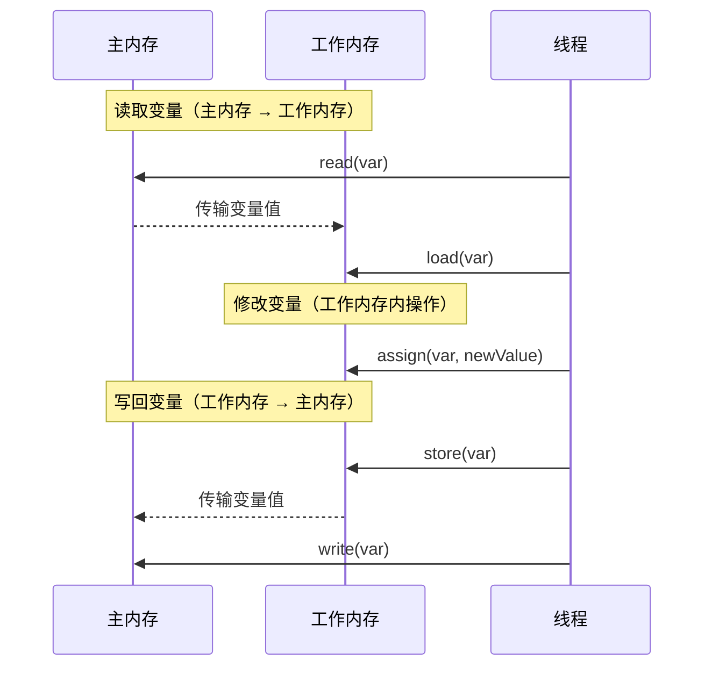
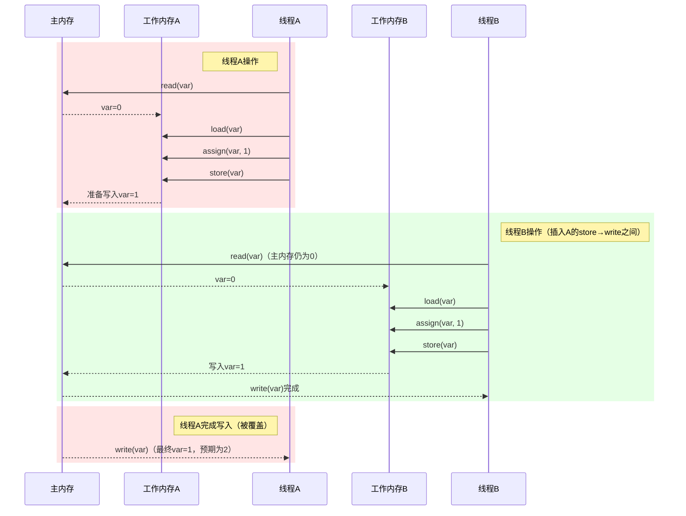
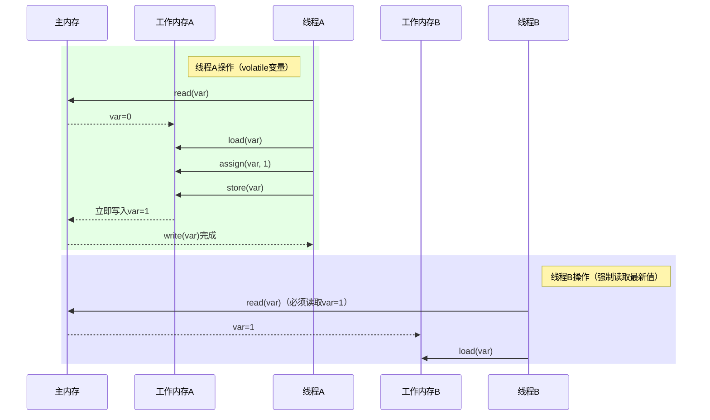

### 1：基本操作流程（单线程）

### 2：多线程下的原子性问题

### 3：同步机制下的原子性保证（如volatile）

### ‌关键说明‌
1. ‌基本流程‌：
  * read→load 是主内存到工作内存的同步。
  * store→write 是工作内存到主内存的同步。
  * assign 是工作内存内的赋值操作。
2. ‌多线程原子性问题‌：
  * 未同步时，store→write 和 read→load 可能被其他线程中断，导致最终结果不符合预期。
3. 同步机制作用‌：
  * volatile 强制 store→write 和 read→load 的原子性，确保修改对其他线程立即可见。