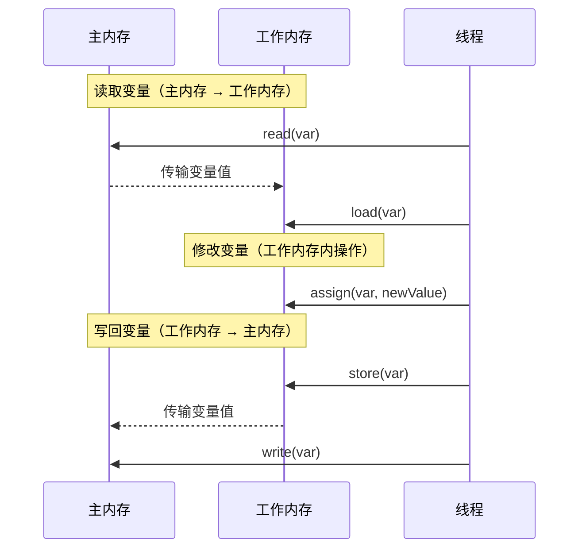
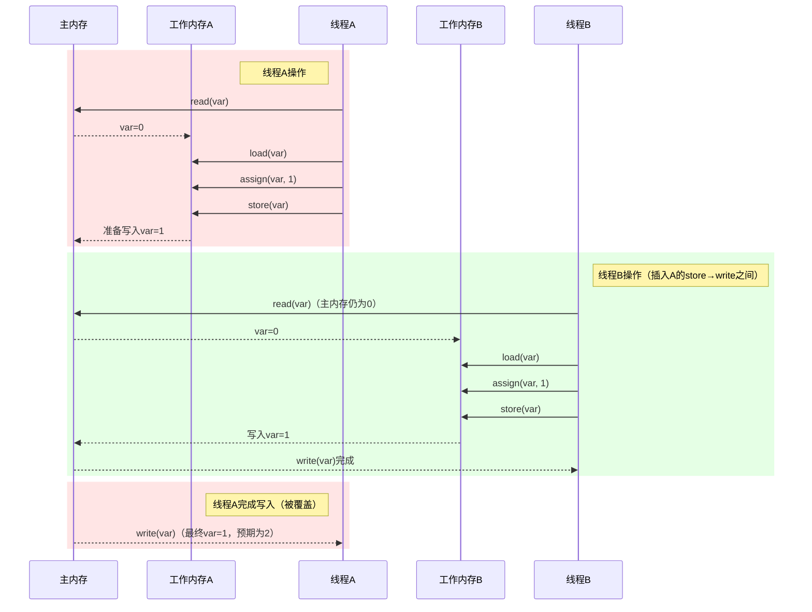
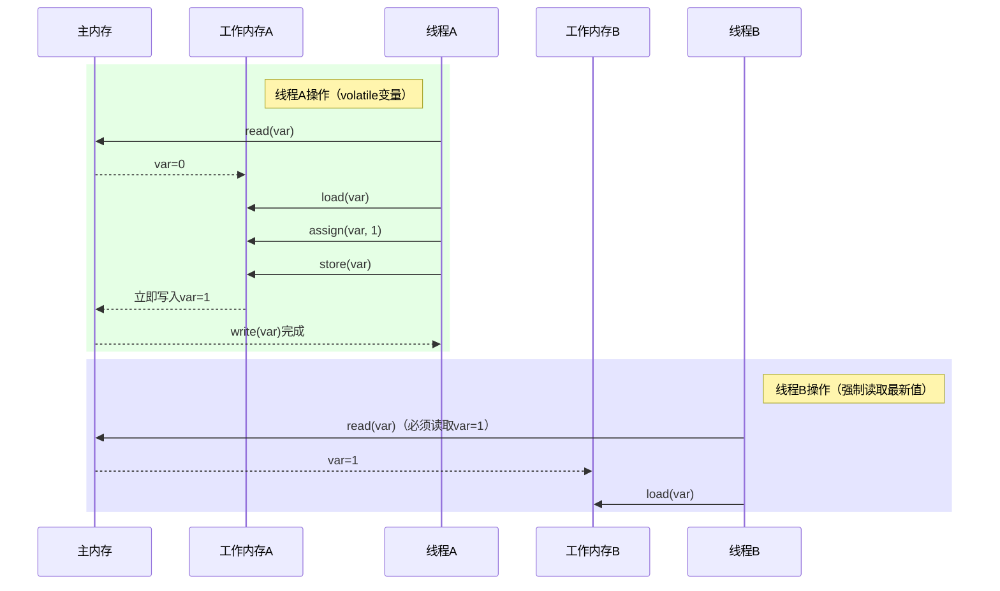

Java Memory Model（JMM）是 Java 虚拟机规范中定义的一组规则，用于屏蔽不同硬件和操作系统的内存访问差异，保证 Java 程序在多线程环境下的**原子性、可见性、有序性**。

## 一、为什么需要 JMM？

多线程环境下，每个 CPU 核心都有自己的缓存（L1/L2/L3），主内存中的数据被多个核心同时读写时会出现三个问题：

- **可见性**：一个线程修改变量，另一个线程可能看不到
- **原子性**：多个操作组合在一起可能被其他线程干扰
- **有序性**：编译器和处理器可能对指令重排序，导致执行顺序与代码顺序不一致

JMM 定义了主内存和工作内存的交互规范，以及 `happens-before` 规则来约束重排序。

## 二、JMM 的内存操作

JMM 定义了 8 种内存操作来完成变量在主内存和工作内存之间的同步：

1. **lock**：作用于主内存，将变量锁定为当前线程独享
2. **unlock**：作用于主内存，释放锁定
3. **read**：作用于主内存，将变量值从主内存传输到工作内存
4. **load**：作用于工作内存，将 read 操作传输来的值放入工作内存副本
5. **use**：作用于工作内存，将工作内存中的变量值传递给执行引擎
6. **assign**：作用于工作内存，将执行引擎计算的值赋给工作内存副本
7. **store**：作用于工作内存，将工作内存中的变量值传送到主内存
8. **write**：作用于主内存，将 store 操作传来的值写入主内存

这 8 个操作必须满足以下规则：
- read 和 load、store 和 write 必须成对出现
- assign 不能单独发生（必须有 use 先获取值才能 assign）
- 变量在工作内存中改变后必须同步回主内存

### 单线程下的基本流程



## 三、三大特性详解

### 原子性问题

多个独立操作组合在一起不是原子的。典型场景：`count++` 实际上是 read→load→use→assign→store→write 六个步骤，线程 A 和线程 B 可能同时执行到中间的 use 步骤。



**解决方式**：使用 `synchronized` 或 `Lock` 保证原子性，或使用 `AtomicInteger` 等 CAS 操作。

### 可见性问题

线程 B 修改了变量，线程 A 可能仍然使用自己工作内存中的旧副本。原因：A 没有及时从主内存重新 read→load。

**volatile 解决可见性**：对 volatile 变量的写操作会立即执行 store→write 刷新到主内存，读操作会强制从主内存 read→load，而不是使用工作内存缓存的旧值。



### 有序性问题

编译器和处理器为了优化性能会对指令重排序，但在多线程下可能导致意外的执行顺序。例如经典的双重检查锁单例：

```java
// 未正确使用 volatile 的版本
private static Singleton instance;
public static Singleton getInstance() {
    if (instance == null) {           // 第一次检查
        synchronized (this) {
            if (instance == null) {   // 第二次检查
                instance = new Singleton();  // 可能被重排序
            }
        }
    }
    return instance;
}
```

`instance = new Singleton()` 实际为三步操作：
1. 分配内存空间
2. 初始化对象
3. 将引用指向内存地址

步骤 2 和 3 可能被重排序，导致另一个线程获得一个未初始化完成的对象。**volatile 通过禁止指令重排序解决了这个问题**。

## 四、happens-before 规则

happens-before 是 JMM 的核心规则，用于判断两个操作之间是否存在数据竞争：

1. **程序顺序规则**：一个线程中的每个操作 happens-before 该线程的后续操作
2. **volatile 变量规则**：对 volatile 变量的写 happens-before 后续对该变量的读
3. **锁规则**：解锁 happens-before 后续对同一把锁的加锁
4. **传递性**：A happens-before B 且 B happens-before C → A happens-before C
5. **线程启动规则**：Thread.start() happens-before 被启动线程中的任何操作
6. **线程 join 规则**：线程中所有操作 happens-before 其他线程对该线程的 Thread.join() 成功返回

## 五、volatile vs synchronized 对比

| 特性 | volatile | synchronized |
|------|----------|-------------|
| 可见性 | 即时可见 | 通过解锁刷新到主内存实现 |
| 原子性 | 不保证 | 保证 |
| 有序性 | 禁止指令重排序 | 通过加解锁保证有序 |
| 性能 | 无锁，开销小 | 有锁，涉及线程挂起和唤醒 |
| 使用场景 | 状态标记、单次写入 | 复合操作、需要原子性的场景 |

## 常见误区
1. **volatile 不能替代 synchronized**：volatile 仅保证可见性和有序性，不保证原子性（如 `count++` 仍然有并发问题）
2. **final 也有可见性保证**：JMM 保证构造函数结束后，final 字段对其他线程可见（除非发生 this 引用逸出）
3. **happens-before 规则不是时间顺序**：它不要求物理时间上 A 先于 B 执行，只要求在语义上 A 的结果对 B 可见
