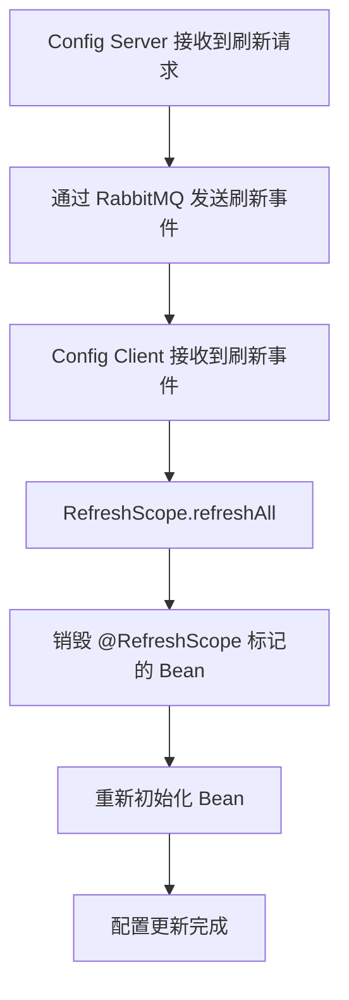

## 核心概念

### （1）什么是 Spring Cloud Config？

Spring Cloud Config 是分布式配置管理工具，用于集中管理微服务的配置文件。它解决的核心问题：微服务数量增加后，配置文件散落在各个服务中，修改一个配置需要逐个修改、重启。

### （2）组成部分

* **Config Server**：配置中心服务器，从后端存储加载配置并通过 HTTP API 暴露
* **Config Client**：配置客户端，启动时从 Config Server 拉取配置

### （3）核心特性

1. **集中化管理**：所有微服务配置统一存储在 Git/SVN/本地等后端
2. **动态刷新**：通过 `/actuator/refresh` 或 Spring Cloud Bus 实现不重启更新配置
3. **多环境支持**：通过 `spring.profiles.active` 加载对应环境的配置（如 `application-dev.yml`）
4. **安全性**：支持配置内容的加密和解密（对称 AES 或非对称 RSA）
5. **版本控制**：Git 后端天然具备版本历史、回滚、分支管理能力
6. **权限控制**：通过 Git 仓库权限 + Config Server 的 Spring Security 双重控制
7. **高可用**：Config Server 可集群部署，通过注册中心实现负载均衡

## 工作原理

### Config Server 配置解析路径

Config Server 根据客户端请求的 `{application}/{profile}/{label}` 路径解析配置。例如客户端请求 `/my-app/dev/master`，Config Server 会在 Git 仓库中查找：

1. `my-app-dev.yml`（应用名+环境）
2. `my-app.yml`（应用名级配置）
3. `application-dev.yml`（全局环境配置）
4. `application.yml`（全局默认配置）

优先级：1 > 2 > 3 > 4（后面覆盖前面）。

### Bootstrap 上下文

Spring Cloud Config Client 使用 **bootstrap context**（由 `bootstrap.yml` 或 `bootstrap.properties` 配置），它在主应用上下文创建之前启动，负责：

1. 从 Config Server 拉取配置
2. 将拉取的配置设置为 `Environment` 属性源
3. 然后才创建主应用上下文

这就是为什么 Config Server 地址必须在 `bootstrap.yml` 而非 `application.yml` 中配置——主上下文启动时必须已经有远程配置可用。

### 配置加载顺序

Config Client 的配置优先级：

1. **bootstrap.yml**（配置 Config Server 地址和应用名）
2. **Config Server 返回的远程配置**
3. **本地的 application.yml**（作用被远程配置覆盖）

## 配置详解

### Config Server 配置

```xml
<dependency>
    <groupId>org.springframework.cloud</groupId>
    <artifactId>spring-cloud-config-server</artifactId>
</dependency>
```

```yaml
server:
  port: 8888

spring:
  cloud:
    config:
      server:
        git:
          uri: https://github.com/your-repo/config-repo.git
          search-paths: config-files
          default-label: master         # 默认分支
          timeout: 10                   # Git 连接超时（秒）
          force-pull: true              # 拉取失败时强制覆盖本地
```

```java
@SpringBootApplication
@EnableConfigServer
public class ConfigServerApplication {
    public static void main(String[] args) {
        SpringApplication.run(ConfigServerApplication.class, args);
    }
}
```

### Config Client 配置

```yaml
spring:
  application:
    name: my-app
  cloud:
    config:
      uri: http://localhost:8888
      profile: dev
      label: master
      # 失败快速响应（启动时连不上 Config Server 则直接启动失败）
      fail-fast: true
      retry:
        initial-interval: 1000
        multiplier: 1.5
        max-attempts: 5
```

### 加密配置

Config Server 支持对配置内容加密，有两种方式：

1. **对称加密**：设置 `encrypt.key=your-secret-key`，然后 POST 到 `/encrypt` 端点获取密文
2. **非对称加密**：配置 RSA 密钥对，将公钥给 Config Server，私钥用于解密

加密后的配置以 `{cipher}` 前缀存储在 Git 中：

```yaml
spring:
  datasource:
    password: '{cipher}AQB...encrypted-string...'
```

## 动态刷新机制

### 手动刷新（逐台刷新）

```bash
curl -X POST http://localhost:8080/actuator/refresh
```

只刷新当前实例，其他实例需要逐一调用。适用于：

* 实例数量少
* 分批蓝绿部署

### 全局刷新（通过 Bus）

```bash
curl -X POST http://localhost:8888/actuator/bus-refresh
```

通过消息中间件广播刷新事件，所有订阅的客户端同时刷新。



### @RefreshScope 的局限性

* 只对标注了 `@RefreshScope` 的 Bean 有效，引用了该 Bean 的其他 Bean 不会自动重建
* `@ConfigurationProperties` 类必须同时标注 `@RefreshScope` 才能刷新
* 静态变量不会随刷新更新

## 排查思路

1. **客户端连不上 Config Server**
   - 检查 `bootstrap.yml` 中的 `spring.cloud.config.uri` 是否正确
   - 检查 Config Server 是否启动、网络是否可达
   - 配置 `fail-fast: true` 和 `retry` 可以在连接失败时快速感知

2. **配置未更新**
   - Config Client 未添加 `@RefreshScope`
   - 调用 refresh 接口时请求体为空（应为 POST 而非 GET）
   - 配置在 Git 中已修改但 Config Server 缓存未刷新——设置 `spring.cloud.config.server.git.refresh-rate=0`

3. **环境加载错误**
   - 检查 Git 仓库中的文件名格式：必须为 `{application}-{profile}.yml`
   - `default-label` 分支名需要与 Git 仓库匹配

4. **加密配置无法解密**
   - 检查 `encrypt.key` 是否在 Config Server 端正确配置
   - 加密的文本首尾是否有 `{cipher}` 前缀
   - 非对称加密时，确保公钥已在环境变量或文件配置中正确设置

5. **Config Server 性能问题**
   - Git 仓库过大会拖慢首次加载——使用 `spring.cloud.config.server.git.clone-on-start=false`（首次访问时才克隆）
   - 每次请求都访问 Git 仓库有性能损耗——使用本地缓存或 `basedir` 指向预克隆仓库
   - 高并发场景考虑配置强制 `skip-ssl-validation` 或使用 SSH 而非 HTTPS 避免证书验证开销
