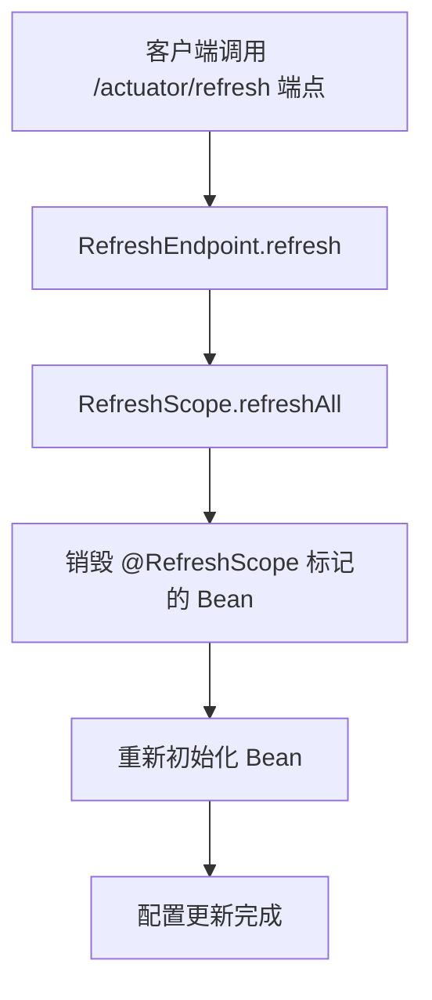
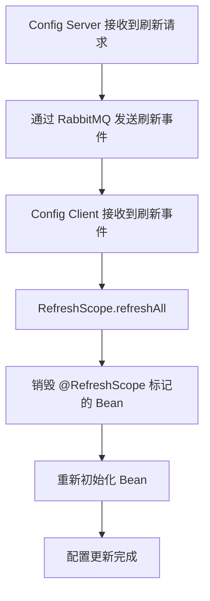

## 核心概念
### （1）什么是 Spring Cloud Config？
* Spring Cloud Config 是一个分布式配置管理工具，用于集中管理微服务应用的配置文件
* 支持从 Git、SVN、本地文件系统等存储后端加载配置

### （2）Spring Cloud Config 的组成
* Config Server：配置中心服务器，负责从存储后端加载配置并提供客户端
* Config Client：配置客户端，从 Config Server 获取配置并应用到应用中。

### （3）Spring Cloud Config 的特点
1. 集中化管
   * 将微服务应用的配置文件集中存储在配置中心（如 Git 仓库），便于统一管理和维护
   * 避免配置文件分散在各个微服务中，降低管理成本
2. 动态刷新
   * 支持配置的动态刷新，无需重启应用
   * 通过 Spring Cloud Bus 或者手动出发 **/actuator/refresh** 端点实现配置的动态更新
3. 多环境支持
   * 支持不同环境（如 dev、test、prod）的配置文件
   * 通过 spring.profiles.active 指定当前环境，自动加载对应配置
4. 安全性
   * 支持配置文件的加密和解密，保护敏感信息（如数据库密码、API 密钥等）。
   * 使用对称加密（如 AES）或非对称加密（如 RSA）对配置文件中的敏感字段进行加密
5. 版本控制
   * Git 集成：Spring Cloud Config 默认支持 Git 作为存储后端，天然具备版本控制能力
      * 可以查看配置文件提交历史，方便回滚到之前的版本
      * 支持分支和标签，便于管理不同版本的配置
   * SVN 集成：如果需要，也可以使用 SVN 作为存储后端，同样支持版本控制
6. 权限控制
   * Git 仓库权限：通过 Git 仓库的权限控制机制（如 GitHub/GitLab 的访问令牌、SSH 密钥等），限制对配置文件的访问
      * 只对授权的用户或者服务才能拉取配置文件
   * Config Server 权限：可以通过 Spring Security 对 Config Server 的访问进行权限控制
      * 例如：限制只有特定的微服务或者用户才能访问 Config Server 的配置接口
7. 高可用性
   * Config Server 支持集群部署，避免单点故障
   * 通过 Eureka 注册中心实现 Config Server 的自动发现和负载均衡
8. 多种存储后端支持
   * 支持 Git、SVN、本地文件系统、JDBC、Vault 等多种存储后端
   * 根据实际需求选择合适的存储后端

## 工作原理
### （1）Config Server
* Config Server 从存储后端（如 Git）加载配置文件
* 通过 Http 接口将配置提供给 Config Client

### （2）Config Client
* Config Client 在启动时从 Config Server 获取配置
* 支持配置的动态刷新（通过 Spring Cloud Bus 或手动触发）

### （3）配置文件的加载顺序
* Config Client 会按照一下顺序加载配置：
   1. **bootstrap.yml** （或 **bootstrap.properties**）：用于加载 Config Server 的地址和应用名称
   2. Config Server 返回的配置
   3. 本地的 **application.yml**（或 **application.properties**）

## Spring Cloud Config 的配置
### （1）Config Server 配置
* pom.xml 依赖：

```xml
<dependency>
    <groupId>org.springframework.cloud</groupId>
    <artifactId>spring-cloud-config-server</artifactId>
</dependency>
```
* application.yml 配置：

```yaml
server:
  port: 8888

spring:
  cloud:
    config:
      server:
        git:
          uri: https://github.com/your-repo/config-repo.git
          search-paths: config-files
```
* 启动类

```java
@SpringBootApplication
@EnableConfigServer
public class ConfigServerApplication {
    public static void main(String[] args) {
        SpringApplication.run(ConfigServerApplication.class, args);
    }
}
```
### （2）Config Client 配置
* pom.xml 依赖：

```xml
<dependency>
    <groupId>org.springframework.cloud</groupId>
    <artifactId>spring-cloud-starter-config</artifactId>
</dependency>
```
* bootstrap.yml 配置：

```yaml
spring:
  application:
    name: my-app
  cloud:
    config:
      uri: http://localhost:8888
      profile: dev
```
* 启动类：

```java
@SpringBootApplication
public class ConfigClientApplication {
    public static void main(String[] args) {
        SpringApplication.run(ConfigClientApplication.class, args);
    }
}
```
## Spring Cloud Config 的使用场景
### （1）集中化管理配置文件
* 将微服务应用的配置文件集中存储在配置中心，便于管理和维护

### （2）多环境支持
* 支持不同环境（如 dev、test、prod）的配置文件，避免手动切换配置

### （3）动态刷新配置
* 支持配置的动态刷新，无需重启应用、



---



### （4）安全性
* 支持配置文件的加密和解密，保护敏感信息


